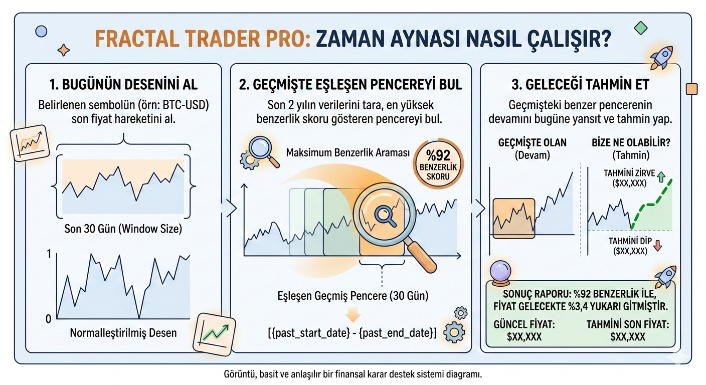

# FRACTAL TRADER PRO

---

## Proje Hakkında

**Proje Tanımı:** Fractal Trader Pro, kripto para ve hisse senedi piyasalarındaki geçmiş fiyat hareketlerini analiz ederek gelecekteki olası trendleri tahmin eden bir "Finansal Karar Destek Sistemi" ve API servisidir. Temelini oluşturan "Zaman Aynası" algoritması, güncel piyasa verilerini son iki yılın verileriyle tarar ve matematiksel olarak en yüksek benzerlik skoruna sahip geçmiş dönemi bulur. Sistem, geçmişte yaşanan bu benzer örüntünün nasıl sonuçlandığına bakarak geleceğe yönelik tahmini zirve ve dip fiyatlarını hesaplar. Kullanıcılar sisteme güvenli bir şekilde üye olabilir, diledikleri finansal semboller (örn: BTC-USD) için anlık verilerle algoritmik analizler başlatabilir ve çıkan sonuçları kişisel notlarıyla birlikte veritabanında saklayıp yönetebilirler.

**Proje Kategorisi:** Finansal Teknoloji (FinTech), Karar Destek Sistemleri, RESTful API Geliştirme

**Referans Uygulama:** [TradingView](https://www.tradingview.com/)

---

## Proje Linkleri

- **REST API Adresi (Swagger UI):** [http://localhost:8000/docs](http://localhost:8000/docs)
- **Web Frontend Adresi:** (Bu projede odak noktası Backend/API mimarisidir, kullanıcı arayüzü testleri FastAPI'nin sunduğu otomatik Swagger UI üzerinden gerçekleştirilmektedir.)

---

## Proje Ekibi

**Grup Adı:** SmileJust

**Ekip Üyeleri:** - Enes Paçalar

---

## Dokümantasyon

Projenin teknik dokümantasyonuna ve görev dağılımlarına aşağıdaki linklerden erişebilirsiniz:

1. [Gereksinim Analizi](Gereksinim-Analizi.md)
2. [REST API Tasarımı (OpenAPI)](API-Tasarimi.md)
3. [Enes Paçalar - Gereksinim Listesi](Enes-Pacalar/Enes-Pacalar-Gereksinimler.md)
4. [Enes Paçalar - REST API Görevleri](Enes-Pacalar/Enes-Pacalar-Rest-API-Gorevleri.md)

*(Not: Bu proje sadece Backend API mimarisi üzerine kurgulandığı için Web/Mobil Front-End dosyaları boş bırakılmıştır.)*